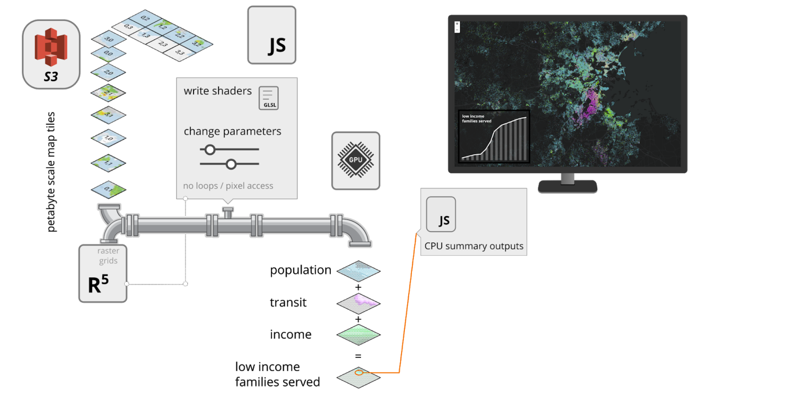
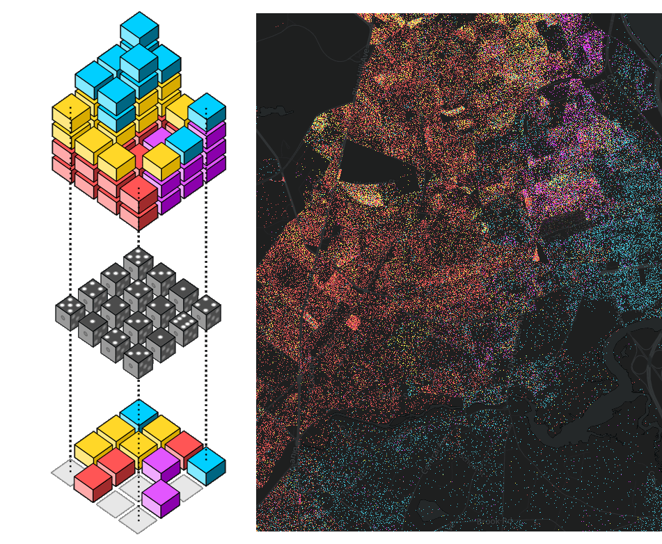
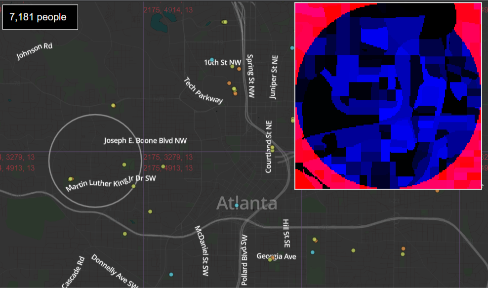
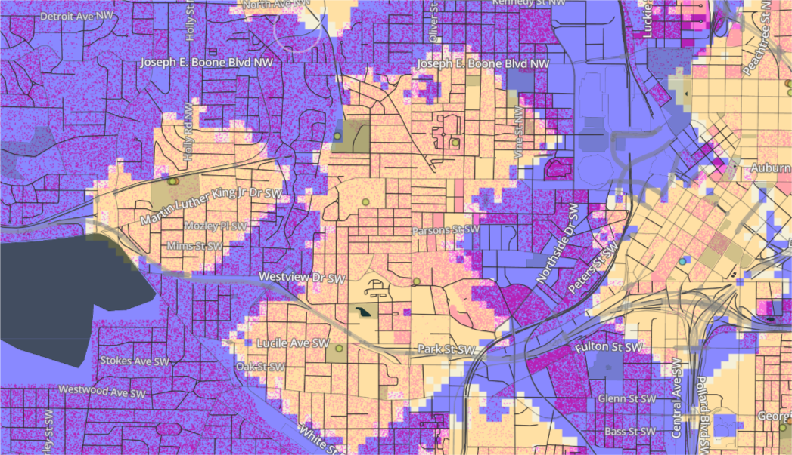

# Zaru
Zaru is a system for creating dynamic real-time map visualizations and dashboards. Zaru takes advantage of the latest graphics hardware and leverages tricks for data organization invented at Sasaki to streamline navigation, querying and representation of massive data sets.

## Overview
Zaru primarily uses [geo-png-db](https://github.com/sasakiassociates/geo-png-db) tiles to visualize map data directly on the GPU. The system enables real-time compositing and visualization of potentially giant data sets. Zaru was developed by design firm Sasaki as a better way to understand the relationship between urban amenities and the people who can access them. The platform is powerful and scalable, but requires no back-end infrastructure to run. As a solution for data sharing and visualization it has broad potential and room for creativity.

## Techniques

Data tiles statically hosted are queried by layer and can be composited and colored on the fly to produce novel outputs. Images are processed directly on the GPU. To ensure real-time rendering speeds, adjustments to colors and numeric values are sent as parameters to the GPU to modify graphics directly.

### Canvas tiles
The low level [regl](https://github.com/regl-project/regl) library is used to render each tile as a canvas with a custom shader. Spatial parameters are passed through to each tile.

### GPU-based compositing
Each tile can composite multiple data sources as individual images in the shader. Compositing rules are written directly in the shader code with logic that can respond to parameters

### Probabilistic Pixel Mixing
Dot density maps are an effective means of showing mixed categorical data and quantity at the same time. When dense overlapping occurs, conventional dot density maps have a hard time rendering all dots with a fair representation: the top layer tends to dominate. Our solution is to use a probabilistic technique to determine whether to render a dot as well as what color to render. While the local results are randomized, the overall impression is consistent and colors are mixed in the correct amounts.

A "gold noise" function is used to approximate random noise on the shader. Changing the "seed" will update the randomization, but when the seed remains static, the noise function always gives the same results. This lets us update and adjust the visualization without "shimmering" noise - unless we choose to update the seed for that effect.

### Real-time mouse inspection
Many millions of pixels can be loaded into the browser at once. While the GPU is optimized to render the images in real-time, working with that many pixels on the CPU is not feasible. In order to provide realtime metrics to the CPU so that the user can inspect certain areas of the map, we use a canvas-based technique to inspect only those pixels within the area of interest.

As the cursor moves, up to 4 image tiles are drawn onto a canvas to cover the circular inspection area. By focusing only on a subset of tiles, we can both copy the pixels and process them on the CPU in real-time.

Screen capture showing debugger visualization used for inspecting pixels within a circle.

### Zoom-beyond
Depending on the data tile source, full pixel resolution may not be available at finer zoom levels. A "zoom-beyond" solution lets users zoom in closer than the data fidelity such that the pixels get rendered as larger blocks. See amenity-access or asdf/asdf-devt-suitability.html in the examples folder to see this in action.

In this extreme example, data is available at zoom level 11 while the current map display is 3 zooms beyond at level 14. Though not ideal, zoom-beyond can provide valuable insights in the event that more detailed data is unavailable. Layering can be used to help with aesthetics and readability.

## Examples

To run examples, use a local server at the root (including src) and load HTML files.

## Showcase

See more [examples here](http://maps.sasaki.com/zaru/). Note that not all examples in the showcase are included in this repository. This is pending further code cleanup and refactoring. 
